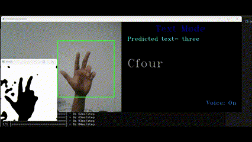

# Real-Time Sign Language Interpretation

This project focuses on real-time sign language interpretation using a Convolutional Neural Network (CNN) trained on a custom gesture dataset. The goal is to build a deep learning model capable of recognizing hand gestures corresponding to numeric and alphabetic signs and providing real-time predictions by maintaining Fairness and Robustness. It is a sign language interpreter using live video feed from the camera.

## Table of Contents

* [Overview](#Overview)
* [Features](#Features)
* [Project Structure](#Project-Structure)
* [Technologies and Tools](#Technologies-and-Tools)
* [Setup](#Setup)
* [Process](#Process)
* [Trustworthiness Evaluation](#trustworthiness-evaluation)
* [Status](#Status)
* [Demo](#Demo)
* [Reference](#Reference)
* [Group](#Group)

## Overview

The Real-Time Sign Language Interpretation using CNN project aims to enable real-time recognition of sign language gestures using a deep learning model trained on a custom dataset. The system is designed to recognize hand gestures representing alphabets and Numbers and convert them into textual output.

The model is optimized for accurate classification real-time processing, and scalability for assistive communication applications.

## Features

Our model was able to predict the all the numbers and alphabetic signs with a prediction accuracy >95%.

Features that can be added:
* Increasing the vocabulary of our model
* Adding feedback mechanism to improve robustness
* Adding more sign languages

## Project Structure

```
├── handhist_set.py    # For setting up hand histogram.
├── gesture_creation.py       # For creating and generating gesture data.
├── all_gestures_display.py      # For visualizing all the generated sign gestures.
├── images_augmentation.py         # For image augmentation by performing rotations.
├── preprocess_images.py           # For loading and preprocessing the images in the dataset
├── CNN_training.py       # logic that required for model training.
├── metrics.py           # Evaluates classification metrics and confusion matrix
├── main.py                 # Main script used for real-time recognition
├── trustworthy.py         # Fairness and robustness evaluation framework
├── graphs.js         # ReactJS component for visualization dashboards
├── Install_Packages.txt     # File that contains all required packages for the application
├── README.md                # Project documentation
```

## Technologies and Tools

- Python 3 or Anaconda
- TensorFlow
- ReactJS + Recharts
- Libraries:
    - `h5py`
    - `numpy`
    - `matplotlib`
    - `seaborn`
    - `scikit-learn`
    - `keras`
    - `opencv-python`
    - `pyttsx3`
    - `SQLite`

## Setup

Use comand promt to setup environment by using install_packages.txt and install_packages_gpu.txt files. 

`python -m pip r install_packages.txt`

This will help you in installing all the libraries required for the project.

## Process

* Execute `handhist_set.py` to generate a hand histogram for gesture creation. 
* After obtaining a well-calibrated histogram, store it in the code directory, or alternatively, use the pre-generated histogram available. [here](https://github.com/vishalvarmavuddaraju/Realtime-SignLanguage-Interpretation/tree/main/code).
* Capture and label gestures using OpenCV with a webcam feed by running ` gesture_creation.py`, which saves them in a database. Alternatively, pre-existing gestures can be used. [here](https://github.com/vishalvarmavuddaraju/Realtime-SignLanguage-Interpretation/tree/main/code).
* Enhance the captured gestures by applying variations, such as flipping images, using `images_augmentation.py`.
* Run `preprocess_images.py` to organize the captured gesture data into separate training, validation, and test sets. 
* Execute `all_gestures_display.py` to visualize all recorded gestures.
* Run `CNN_training.py` to train the model using Keras.
* After training, run `metrics.py` to evaluate model performance on test data.
* Execute `main.py` to launch the real-time gesture recognition system. This uses the webcam, recognizes hand gestures using the trained model, displays the predicted text, and optionally speaks it aloud using text-to-speech (TTS).
* Execute `trustworthy.py` to assess the model’s **fairness and robustness**
* (Optional) Use `graphs.js` inside a React project to create interactive dashboards visualizing fairness and robustness results using Recharts.
* Press `s` to save hand histogram
* Press `c` to start capturing gestures
* Press `v` to toggle voice output on/off
* Press `q` to exit the application

## Trustworthiness Evaluation

To ensure our model is not only accurate but also ethical and reliable, we incorporated a dedicated trustworthiness evaluation covering both **fairness** and **robustness**.

### Fairness Assessment

We simulated diverse user conditions for hand size (small, medium, large) and lighting (low, medium, high). The model's performance was then measured across these groups using metrics such as:
- **Equal Opportunity** – checks if true positive rates are consistent across groups.
- **Equalized Odds** – examines both false positive and true positive rates.
- **Demographic Parity** – ensures outcome likelihood is similar across demographics.
- **Disparate Impact** – compares model performance between privileged and unprivileged groups.

### Robustness Testing

We evaluated the model’s behavior under common real-world disturbances using:
- **Gaussian noise**
- **Brightness and rotation adjustments**
- **FGSM adversarial attacks**

Accuracy degradation and gesture vulnerability to attacks were analyzed.

### Visualization and Insights

All results were visualized using static plots and can also be rendered interactively using our React-based `graphs.js` component. 

> These evaluations help ensure the system performs reliably and fairly for a diverse set of users, improving its real-world applicability.

## Status

* Completed the Model training with more than 95% test accuracy
* Trustworthiness evaluation (fairness + robustness) is fully integrated, with metrics and mitigation strategies implemented.
* Exploring improvements for better performance under poor lighting conditions and across diverse user backgrounds.

## Demo


## Reference

We have taken this model [here](https://youtu.be/NBzqY9tJd7M?feature=shared) as reference and used chatgpt and deepseek for development of model

## Group
1) Vishal Varma Vuddaraju UID: U39828798
2) Rasmitha Chinthalapally UID: U57992748
3) Srinija Reddy Maddula UID: U20959745
